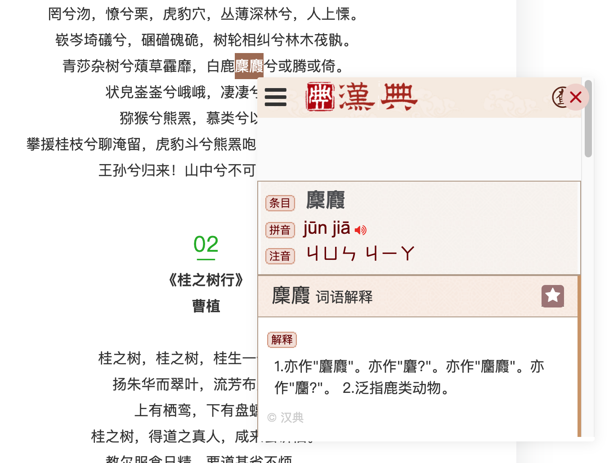
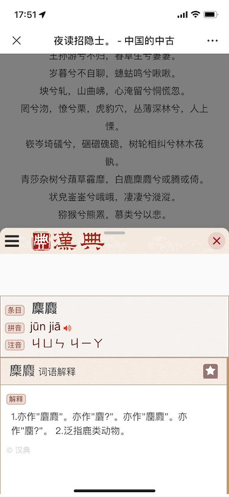

## 划词，查汉典
网页划词，一步直达汉典释义，桌面、移动端全适配。

[Oline Demo](https://medieval-china.github.io/2021/09/27/202109/28%E5%A4%9C%E8%AF%BB%E9%87%8A%E5%A5%A0%E8%AF%97%E3%80%82%E5%AD%94%E5%AD%90%E8%AF%9E%E8%BE%B0%E3%80%82/)

#### PC端示例图


#### 移动端示例图



## 特性
1. 体积小，未引入任何第三方库，原生实现，`gzip`大小`3kb`
2. 桌面、移动端全适配 (移动端支持手势下拉关闭)
3. 可实例化, 参数可配置
4. 简洁API，唯一 `onEnd` API
5. 弹窗位置自动计算边界

## 引入方法

### 1. ES6 Module
```js
import SelectionHandian from 'selection-handian'

new SelectionHandian({
  /**
   * 查词结束时触发
   * @param {MouseEvent} event 鼠标事件
   * @param {String} text 查词词条
   * @param {Object} instance new SelectionHandian的实例
   */
  onEnd(event, text, instance) {
    // your logic
  }
}) 

```

### 2. Web Script

```js

<script async src="/js/selection.popup.min.js"></script>
```

可选配置项：
```js
const defaultOptions = {
  // 汉典最大加载时间
  MAX_TIME_OUT: 3500,
  // 浮窗挂载节点
  container: document.body,
  // 监听节点
  el: document.body,
  // 滚动容器，默认为 document.documentElement || document.body
  scroller: void 0,
  // 浮窗
  popup: null,
  // x轴位移量
  offsetX: 2,
  // y轴位移量
  offsetY: 12,
  // 选择结束
  onEnd: () => {},
}
```